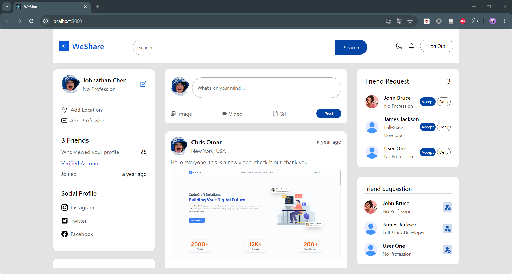

# WeShare

WeShare is a content sharing application that allows users to share and discover various types of content, including articles, images, and videos. With an intuitive interface, WeShare is designed to make it easy for users to share information and find interesting content from different sources.

## Homepage

## Features

- **User Registration**: Users can easily sign up and create an account.
- **Share Content**: Users can upload and share content in various formats.
- **Explore Content**: Discover popular and recent content from other users.
- **Likes and Comments**: Users can provide feedback through likes and comments.
- **User Profiles**: Each user has a personal profile to showcase shared content.
